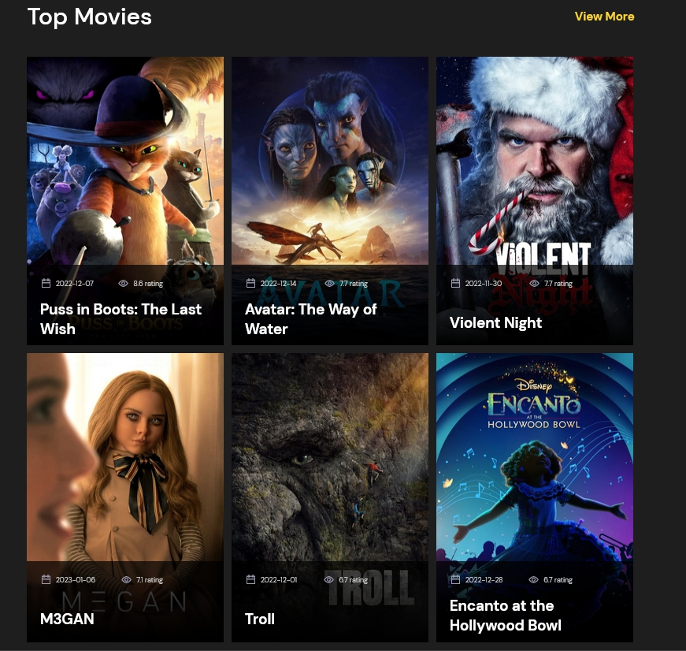

# Popular movies from [TMDB](https://www.themoviedb.org/ "https://www.themoviedb.org/")

Display popular movies with using API	[The Movie Database (TMDB)](https://www.themoviedb.org/)

You can watch today popular movies [here](https://natalya-safarevich-movies.netlify.app/ " Movies").

In this project I mastered:

* HTML
* CSS
* JavaScript
* API
* Fetch
* DOM
